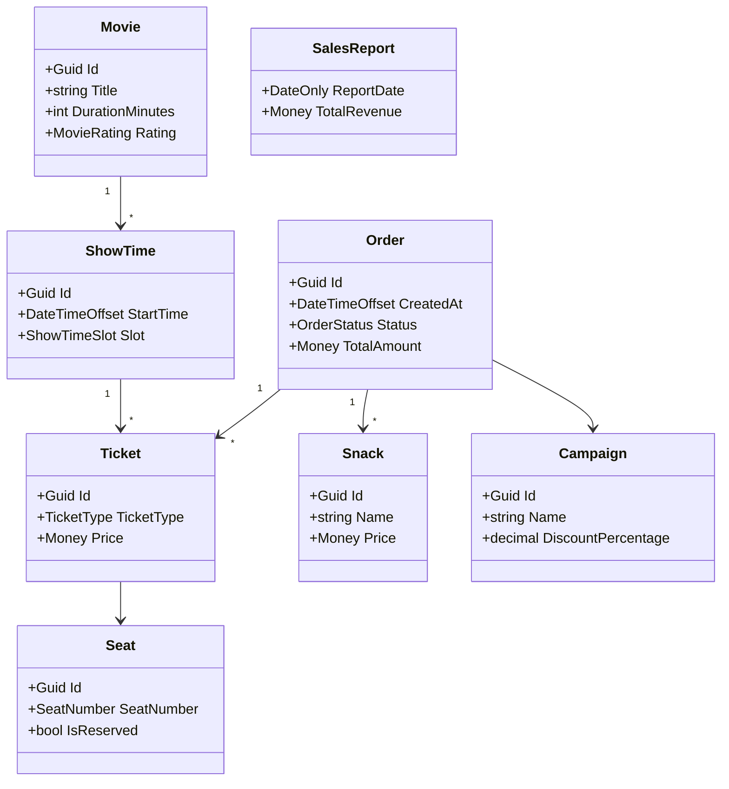

# Cinema Sales — Domain Model

Lightweight DDD view of the **CinemaSales.Domain** bounded context.

## Class diagram

_Note: `Snack` on an order is modeled as `OrderSnackLine` entities referencing catalog `Snack` identifiers; the diagram reflects the conceptual link._

## Aggregate boundaries

- **Movie** — root; owns **ShowTime** entities.
- **Order** — root; owns **Ticket** and **OrderSnackLine** entities; references **Campaign** by identifier when a discount is applied.

## Domain services

| Service | Responsibility |
|--------|----------------|
| `IPricingService` / `PricingService` | Ticket and snack subtotals; grand total with VAT and discounts. |
| `IVatCalculationService` / `VatCalculationService` | VAT on snack lines by `VatType`. |
| `IDiscountService` / `DiscountService` | Validates campaign and code; computes discount amount. |
| `ISeatAllocationService` / `SeatAllocationService` | Prevents double booking for the same show time and seat. |
