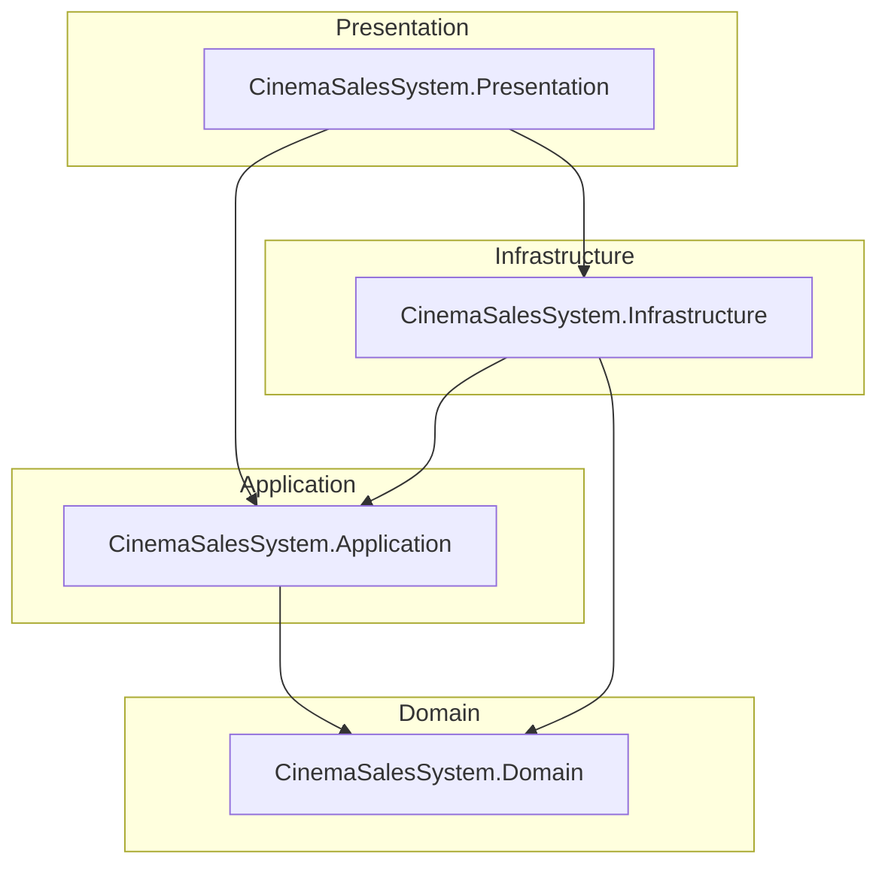

# Architecture — CinemaSalesSystem

This document describes the **Clean Architecture** layout, **lightweight DDD** usage, dependency rules, and the main technology choices for CinemaSalesSystem.

---

## Clean Architecture Overview

The solution separates **policy** (business rules) from **mechanisms** (UI, database, frameworks). Inner layers define contracts; outer layers implement them. That keeps the domain **testable** and **stable** when infrastructure or UI change.

**Dependency rule:** source code dependencies only point **toward the center**. `CinemaSalesSystem.Domain` has no project references to other layers. `CinemaSalesSystem.Application` depends only on Domain. `CinemaSalesSystem.Infrastructure` depends on Application and Domain. `CinemaSalesSystem.Presentation` depends on Application and Infrastructure (composition root).

---

## Layer Responsibilities

| Layer | Project | Responsibility |
|-------|---------|----------------|
| **Domain** | `CinemaSalesSystem.Domain` | Aggregates (e.g. `Movie`), entities, value objects (`Money`, `DiscountCode`), domain services (`PricingService`), exceptions, domain events. No EF, no UI. |
| **Application** | `CinemaSalesSystem.Application` | Use cases, commands/queries, DTOs, mappers, application services, **abstractions** (`IMovieRepository`, service interfaces). Orchestrates domain objects. |
| **Infrastructure** | `CinemaSalesSystem.Infrastructure` | `ApplicationDbContext`, EF configurations, repository implementations, seed data, DI extension `AddInfrastructure`. |
| **Presentation** | `CinemaSalesSystem.Presentation` | Console host (`Program.cs`), Serilog bootstrap, menus, presentation services, user input/output. Wires `AddApplication` + `AddInfrastructure`. |

---

## Dependency Flow Diagram

The following diagram shows **allowed** project references (high level).

Runtime flow for a typical operation: **Presentation** calls an application service or use case → **Application** loads or persists via **abstractions** implemented in **Infrastructure** → **Domain** invariants enforce business rules.

---

## DDD Building Blocks

| Building block | Role in this solution |
|----------------|------------------------|
| **Aggregate roots** | e.g. `Movie` (owns show times), `Order` — consistency boundaries and primary persistence units. |
| **Entities** | Objects with identity (`Ticket`, `Seat`, `Snack`, …). |
| **Value objects** | Immutable, compared by value (`Money`, `VatRate`, `AgeCategory`, `DiscountCode`). |
| **Domain services** | Logic that does not naturally belong on one entity (`PricingService`, discount/VAT-related services). |
| **Domain events** | Types such as `TicketReservedEvent` (modeling side effects; infrastructure may ignore some for in-memory EF). |
| **Repositories (concept)** | Implemented in Infrastructure; **interfaces** live in Application (`Abstractions/Persistence`). |
| **Ubiquitous language** | Captured in code names and in-domain markdown under `src/CinemaSalesSystem.Domain/` where present. |

This is **lightweight DDD**: tactical patterns are used where they reduce complexity; the codebase avoids an over-engineered generic repository or event bus unless needed.

---

## Design Decisions

| Decision | Rationale |
|----------|-----------|
| **In-memory EF Core** for default deployment | Fast local demos and tests; swap connection string / provider later without changing domain rules. |
| **Repository interfaces in Application** | Application defines *what* persistence must do; Infrastructure defines *how*. |
| **DTOs and mappers in Application** | Keeps domain free of serialization/UI shapes; Presentation maps to view concerns where needed. |
| **Serilog only in Presentation** | Logging is a cross-cutting infrastructure concern from the app’s point of view; configuration stays at the host edge. |
| **Central Package Management** | Single version source in `Directory.Packages.props` for reproducible builds. |

---

## SOLID Principles

| Principle | How it shows up |
|-----------|-----------------|
| **S**ingle responsibility | Use cases and services are focused; repositories handle persistence only. |
| **O**pen/closed | New behaviors often added via new use cases or strategies without modifying unrelated types. |
| **L**iskov substitution | Repository implementations honor interface contracts consumed by Application. |
| **I**nterface segregation | Persistence and application service interfaces are split by aggregate/concern. |
| **D**ependency inversion | Application depends on abstractions; Infrastructure depends on concrete EF and implements those abstractions. |

---

## Technology Justification

| Technology | Why |
|------------|-----|
| **.NET 8** | LTS-aligned runtime, performance, broad tooling. |
| **EF Core** | Strong mapping for aggregates, migrations path for future SQL providers, aligns with Microsoft stack. |
| **Generic host + DI** | Standard composition, configuration, and lifecycle for console and future hosted services. |
| **Serilog** | Structured logs, sinks, and JSON-friendly output for operations. |
| **xUnit + FluentAssertions + Moq** | Common .NET test stack; Moq for application-layer isolation; FluentAssertions for readable assertions. |

---

## Namespace Note

Project folders use the **`CinemaSalesSystem.*`** naming convention; many C# **namespaces** use the historical **`CinemaSales.*`** prefix for domain and application types. New code may gradually align naming; documentation refers to **projects** and **layers** as the source of truth for boundaries.

---

## Related Documents

- [ProjectStructure.md](ProjectStructure.md) — directory map  
- [DeploymentGuide.md](DeploymentGuide.md) — build and run  
- [TestingGuide.md](TestingGuide.md) — verification strategy  
