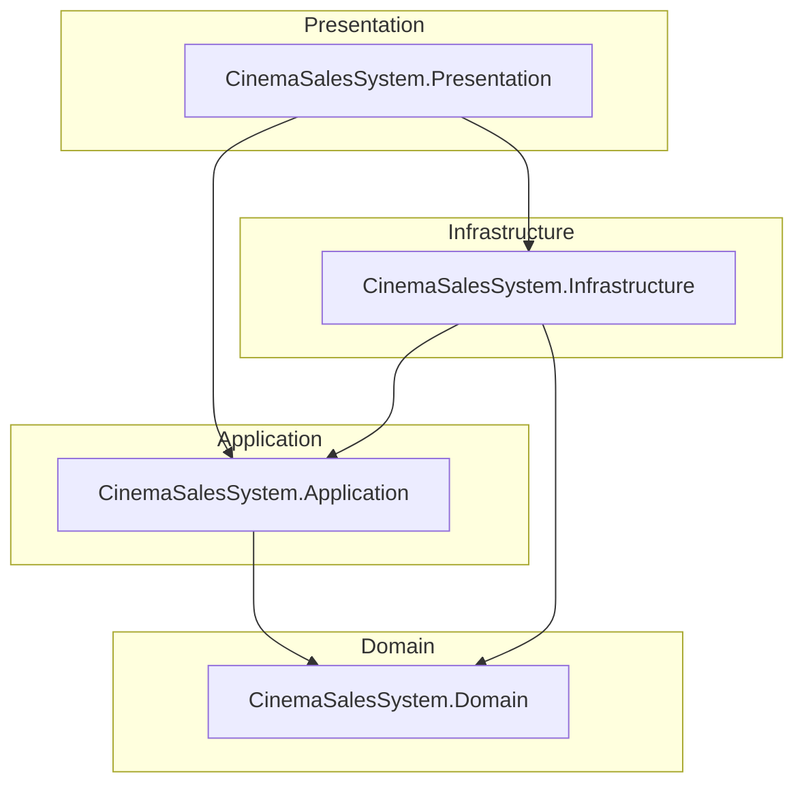

# Architecture Documentation — CinemaSalesSystem

**Version:** v1.0.0 · **Author:** AMIN GHADERI  
**Paradigm:** Clean Architecture · **Domain style:** Lightweight Domain-Driven Design (DDD)

---

## Clean Architecture Overview

The solution separates **business rules** (center) from **delivery mechanisms** (UI, database, frameworks). Inner layers define **abstractions**; outer layers **implement** them. Dependencies point **inward** only, so the domain stays testable and stable when infrastructure or the console host change.

For additional narrative and decisions, see also [Architecture.md](../Architecture.md) in the docs root.

---

## Layer Responsibilities

| Layer | Project | Responsibility |
|-------|---------|----------------|
| **Domain** | `CinemaSalesSystem.Domain` | Aggregates (`Movie`, `Order`), entities, value objects (`Money`, `DiscountCode`), domain services, domain events, exceptions. **No** EF, **no** UI references. |
| **Application** | `CinemaSalesSystem.Application` | Use cases, DTOs, mappers, application services, **persistence and service interfaces** (`IMovieRepository`, …). Orchestrates the domain. |
| **Infrastructure** | `CinemaSalesSystem.Infrastructure` | `ApplicationDbContext`, EF configurations, repository implementations, migrations, seeding, `AddInfrastructure` extension. |
| **Presentation** | `CinemaSalesSystem.Presentation` | Composition root wiring (`Program.cs`), Serilog, `appsettings`, console menus and presentation services. |

---

## Dependency Flow

**Allowed project references:**

```
Presentation  →  Application
Presentation  →  Infrastructure   (composition root: AddInfrastructure, EF tooling)

Infrastructure  →  Application
Infrastructure  →  Domain

Application  →  Domain

Domain  →  (none)
```

**Runtime flow (conceptual):** User action in **Presentation** → application service / use case in **Application** → domain invariants → persistence via interfaces implemented in **Infrastructure**.

### Textual diagram (dependencies)

```
┌─────────────────────────────────────────┐
│           Presentation                 │
│  (host, menus, Serilog, wiring)        │
└───────────────┬───────────────────────┘
                │
                ▼
┌─────────────────────────────────────────┐
│     Application        ◄──────┐        │
│  (use cases, DTOs, ports)      │        │
└───────────────┬───────────────┼────────┘
                │               │
                ▼               │
┌───────────────────────────────┼────────┐
│           Domain              │        │
│  (model, rules, events)       │        │
└───────────────────────────────┼──────┘
                ▲               │
                │               │
┌───────────────┴───────────────┴────────┐
│           Infrastructure              │
│  (EF Core, repos, migrations, seed)    │
└───────────────────────────────────────┘
```

Arrows indicate **compile-time** references: Infrastructure and Application both depend on Domain; Presentation depends on Application and Infrastructure to register implementations.

---

## DDD Principles (Lightweight)

| Concept | Use in CinemaSalesSystem |
|---------|---------------------------|
| **Aggregates** | e.g. `Movie` (owns show times), `Order` — consistency boundaries. |
| **Entities** | Identity-driven objects (`Ticket`, `Seat`, `Snack`, …). |
| **Value objects** | Immutable, equality by value (`Money`, `VatRate`, `DiscountCode`). |
| **Domain services** | Logic spanning multiple entities (`PricingService`, VAT/discount behavior). |
| **Repositories** | **Interfaces** in Application; **implementations** in Infrastructure. |
| **Ubiquitous language** | Reflected in type and method names in Domain and Application. |

The approach is **lightweight**: tactical DDD where it reduces complexity, without mandatory generic repositories or heavy event infrastructure unless needed.

---

## Architectural Diagram (Mermaid)

Equivalent to the dependency graph in [Architecture.md](../Architecture.md):



---

**Author:** **AMIN GHADERI**  
© 2026 AMIN GHADERI
